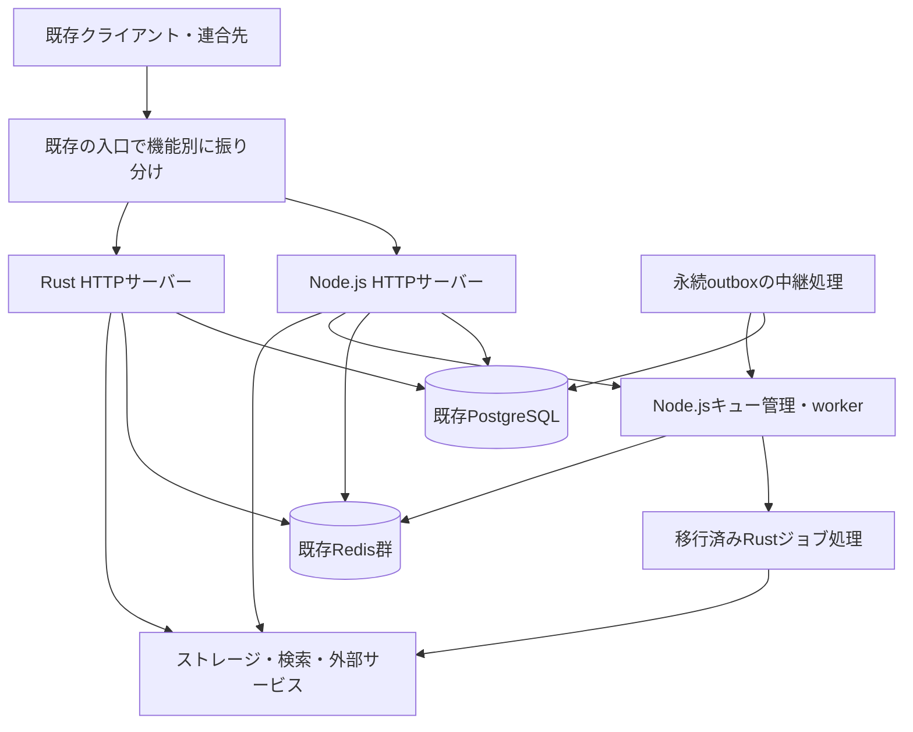

# バックエンドのRust移行計画

作成日: 2026-09-05

状態: 将来の実装に向けた設計案。技術選定・期間・数値目標は初期検証後に確定する。

調査基準: コミット `4b7da56b51` と作成時の作業ツリー。依存関係の未コミット変更を含むため、着手時に基準コミット・ロックファイル・設定の対応を改めて記録する。

## 1. 目的と基本方針

CherryPick縁側フォークのバックエンドを、既存ユーザー・クライアント・連合先が利用を継続できる形で、TypeScript / Node.jsからRustへ段階的に置き換える。[ROADMAP](../ROADMAP.md)のRust化の検討を、実装単位と移行判定に分解した計画である。

主な目的は、CPU・メモリ使用量の改善、負荷増加時の安定性、ドメイン間の依存整理である。Rust化による改善幅は未測定であり、SQL、外部通信、画像処理などが支配的な場合は言語の変更だけでは改善しない。初期段階で既存実装の改善案とも比較し、移行費用に見合う対象から進める。

採用する基本方針は次のとおり。

- 同一の公開URLの背後でNode.js版とRust版を併存させ、検証した機能単位で担当を移す。
- 当面は既存のPostgreSQLスキーマ、ID、Redisの用途、オブジェクトストレージを維持する。
- 一つの操作の書き込みと副作用は一つの実装が担当する。リクエストの複製による本番への二重書き込みは行わない。
- フロントエンドと`cherrypick-js`が利用するHTTP・WebSocket契約を維持する。連合は現在の相互運用上の挙動も検証対象にする。
- 各段階に継続・保留の判定と切り戻し手順を設ける。部分移行で効果が十分な場合は、その状態を保守できる。

初期移行にフロントエンドの書き換え、DB製品の変更、公開APIの再設計、IDの変更、検索基盤の統合は含めない。最終的にはHTTP、連合、ジョブ、配信、運用CLIを含むバックエンドのNode.js実行依存を解消する。フロントエンド・SDKのビルドに必要なNode.jsは別扱いとする。

## 2. 現状と移行対象

実装上の根拠を以下に示す。構成の記述はソースの確認結果であり、本番環境の利用状況や負荷を計測した結果ではない。

| 領域 | 現行実装・参照 | 移行で維持するもの |
| --- | --- | --- |
| 起動・構成 | [boot](../packages/backend/src/boot)、[env.ts](../packages/backend/src/env.ts)、[config.ts](../packages/backend/src/config.ts)。Node.jsクラスタ、サーバー／キューの起動分離、NestJSによるDI | 設定の意味、起動モード、終了処理、接続数・並列度の制御 |
| HTTP・画面配信 | [ServerService](../packages/backend/src/server/ServerService.ts)、[server/web](../packages/backend/src/server/web)。FastifyでAPI、OAuth、ActivityPub、ファイル、Web画面などを登録 | URL、ヘッダー、リダイレクト、静的アセット、埋め込み・OGP・フィード |
| 公開API・認証 | [server/api](../packages/backend/src/server/api)、[endpoint-base.ts](../packages/backend/src/server/api/endpoint-base.ts)。`endpoints`配下に448ファイル | 入力変換、既定値、権限、エラー、レート制限、返却用データへの変換 |
| 永続化 | [postgres.ts](../packages/backend/src/postgres.ts)、[models](../packages/backend/src/models)、[migration](../packages/backend/migration)。TypeORMとPostgreSQL | テーブル・列・制約・索引、トランザクション、マイグレーション履歴 |
| Redis | [GlobalModule](../packages/backend/src/GlobalModule.ts)、[CacheService](../packages/backend/src/core/CacheService.ts)、[GlobalEventService](../packages/backend/src/core/GlobalEventService.ts) | 通常キャッシュ、Pub/Sub、ジョブ、タイムライン、リアクションの用途別接続とデータ形式 |
| タイムライン・投稿 | [NoteCreateService](../packages/backend/src/core/NoteCreateService.ts)、[NoteDeleteService](../packages/backend/src/core/NoteDeleteService.ts)、[FanoutTimelineService](../packages/backend/src/core/FanoutTimelineService.ts) | 公開範囲、ブロック・ミュート、配布先、削除、通知、検索・統計への反映 |
| リアルタイム配信 | [StreamingApiServerService](../packages/backend/src/server/api/StreamingApiServerService.ts)、[server/api/stream](../packages/backend/src/server/api/stream) | WebSocketメッセージ、購読・解除、閲覧権限、再接続時の挙動 |
| ジョブ・定期処理 | [QueueService](../packages/backend/src/core/QueueService.ts)、[QueueProcessorService](../packages/backend/src/queue/QueueProcessorService.ts)、[processors](../packages/backend/src/queue/processors)。BullMQと39のprocessorファイル | 再試行、遅延・定期ジョブ、ロック、失敗管理、並列度、予約投稿・自動削除 |
| 連合 | [ActivityPubServerService](../packages/backend/src/server/ActivityPubServerService.ts)、[core/activitypub](../packages/backend/src/core/activitypub)、[InboxProcessorService](../packages/backend/src/queue/processors/InboxProcessorService.ts) | Actor / Object URI、署名鍵、署名検証、配送・再送、フォロー・移行・削除、拡張プロパティ |
| メディア・外部接続 | [DriveService](../packages/backend/src/core/DriveService.ts)、[FileServerService](../packages/backend/src/server/FileServerService.ts)、[backend/package.json](../packages/backend/package.json) | ローカル／S3互換ストレージ、ファイルURL、画像・動画処理、URLプレビュー、メール、Web Push、Webhook |
| 検索 | [SearchService](../packages/backend/src/core/SearchService.ts)、[config.ts](../packages/backend/src/config.ts) | `sqlLike`、`sqlPgroonga`、Meilisearch、Elasticsearchの各コード経路、公開範囲・検索許可、検索条件・索引更新 |
| その他の機能 | [CoreModule](../packages/backend/src/core/CoreModule.ts)、[ChatService](../packages/backend/src/core/ChatService.ts)、API一覧 | チャットとその連合、アンテナ、リスト、チャンネル、クリップ、ページ、ギャラリー、Play、ロール、モデレーション、インポート／エクスポート |
| SDK・検証・配布 | [ルートpackage.json](../package.json)、[backend tests](../packages/backend/test)、[連合テスト](../packages/backend/test-federation/README.md)、[Dockerfile](../Dockerfile)、[chart](../chart) | 型生成、既存テスト、Docker・systemd・Helm、更新・復旧手順 |

448はファイル数であり、公開ルート数や移行工数を表すものではない。フェーズ0で実際のルート・ジョブ・定期処理を一覧化する。

このフォーク固有の`private`公開範囲、`isIndexable`、予約・自動削除、チャット連合などを独立した受入項目にする。[フォーク差分資料](jp/Difference.md)と[変更履歴](../CHANGELOG_engawa.md)も参照するが、資料にはMeilisearch削除の記述がある一方で現行コードには経路が残っている。対応範囲はコード・設定仕様・運用実績を照合して確定し、資料の記述だけで機能を落とさない。

さらに、[ノート編集](../packages/backend/src/core/NoteUpdateService.ts)・[履歴](../packages/backend/src/core/NoteHistoryService.ts)・[下書き](../packages/backend/src/core/NoteDraftService.ts)、Bubbleやcatsを含むタイムライン、独自翻訳、リモートファイル用ストレージの分離を担当表に記載する。本家Misskeyの機能一覧だけを移行対象の根拠にしない。

## 3. 目標構成と技術選定

### 3.1 移行中の構成

図のoutboxとRust処理への接続は新設案である。最初の参照API移行では追加せず、書き込み・ジョブを移す段階で導入する。

最終構成は、ドメイン別のモジュールを持つRustバックエンドを基本とし、HTTPとworkerを別プロセスとして起動できるようにする。初めから多数の独立サービスに分割せず、移行中の境界を後から同一プロセス内の呼び出しに置き換えられる設計にする。

候補配置は`packages/backend-rs/`とする。まず一つのCargoパッケージにHTTP、業務処理、DB・外部接続のモジュールを置き、共有が実際に必要になった部分だけcrateに分ける。Cargoのビルド・チェックはpnpmと別のCIジョブにし、必要な呼び出しだけルートスクリプトに追加する。以下のパスや設定は計画上の提案であり、まだ作成していない。

### 3.2 技術候補と採否条件

| 用途 | 第一候補・方針 | 採用前に確認する点 |
| --- | --- | --- |
| 非同期処理・HTTP・WebSocket | Tokio + Axum / Tower。AxumはTokio / Hyperとの統合とTowerのミドルウェアを提供する。[公式資料](https://docs.rs/axum/latest/axum/) | raw bodyの保持、Fastify相当のエラー変換、multipart、接続終了、負荷制限、チームの保守性 |
| PostgreSQL | SQLx。非同期SQL、PostgreSQLドライバー、接続プール、SQLを検査するマクロを持つ。[公式資料](https://docs.rs/sqlx/latest/sqlx/) | 現行の配列・JSON・日時・enum・NULL・引用付き列名・索引の互換、複雑なSQLの保守性 |
| シリアライズ | Serde / serde_jsonを候補にPoCで評価する | `undefined`相当の省略と`null`の区別、整数・日時、未知プロパティ、既定値、既存バリデーションとの違い |
| Redis | 非同期Rustクライアントを用途別の小さなadapterに閉じ込める | 接続再確立、prefix、Lua、Pub/Sub、TLS、クラスタを含む実際のサポート設定 |
| ジョブ | 初期はNode.js / BullMQがキューを管理し、移行済み処理を内部RPCで呼ぶ | ロック更新、再試行・遅延・定期実行、障害復旧、管理画面との互換 |
| 将来のRustキュー管理 | 公式Rustクレート`bullmq-official`を評価候補にする。[公式資料](https://docs.bullmq.io/rust/introduction) | 現行`bullmq` 5.61.0との相互運用、使用中の機能、Lua・ジョブ状態の互換性を実機検証する。採用済みとは扱わない |
| 外向きHTTP・暗号・認証 | Rustの既存ライブラリを比較し、署名・認証のadapter越しに利用する | リダイレクト、DNS・IP制限、HTTP署名、JSON-LD正規化、既存鍵・パスワードハッシュ・WebAuthnの互換 |
| 画像・動画・MFM / HTML変換 | 初期は既存処理への委譲を許容し、入出力fixtureを先に作る | sharp / libvips、FFmpeg、canvas、Summaly、MFM、HTMLサニタイズの出力・資源使用量・配布条件 |
| ログ・計測 | 構造化ログとリクエスト／ジョブをまたぐtrace IDを導入する | 現行Sentry・Cloud Loggingの利用設定、機密値の除外、メトリクスの系列数、運用コスト |

外部資料は作成日に確認したもの。ライブラリのバージョン、MSRV、TLS実装、依存機能は着手時に再確認してADR（設計判断の記録）と`rust-toolchain.toml`、`Cargo.lock`に固定する。一般的な機能対応だけで現行挙動と互換と判断しない。

## 4. 互換性を守るための契約

### 4.1 HTTP・SDK

[ApiCallService](../packages/backend/src/server/api/ApiCallService.ts)、[ApiServerService](../packages/backend/src/server/api/ApiServerService.ts)、[endpoint-base.ts](../packages/backend/src/server/api/endpoint-base.ts)の共通処理を、各機能の移植より先に契約化する。

| 契約 | 必須の検証例 |
| --- | --- |
| 入力 | POST主体のルート、`allowGet`、JSONとmultipart、型変換、Ajvの既定値、空文字・省略・`null`・不正入力 |
| 認証・権限 | Bearerヘッダーと`i`の優先順位、native / app / MiAuth / flash token、scope、ロール、凍結・失効 |
| 出力 | フィールド名、型、配列順序、日時、ID、非公開フィールドの除外、`undefined`由来のフィールド省略 |
| HTTPの意味 | 200と204、エラーのstatus、`error: { message, code, id, kind, info? }`、`WWW-Authenticate`、`Retry-After`、`Content-Type`とcharset、CORS、キャッシュ |
| ページング | `sinceId` / `untilId`、同時刻の並び、削除・追加とページ境界、上限値 |
| 副作用 | tokenの`lastUsedAt`、IP履歴、既読、レート制限、キャッシュ更新。参照APIでも書き込みがないとは限らない |

現在の型生成は、[gen-spec.ts](../packages/backend/src/server/api/openapi/gen-spec.ts)などのTypeScript定義から`api.json`を生成し、`cherrypick-js`の生成コードへ反映する経路である。以下の順で継承する。

1. フェーズ0で現行`api.json`と意味的な差分をCI成果物として保存する。振る舞いのfixtureも併せて管理する。
2. 混在初期はTypeScriptの契約定義を正とし、Rustが同じ契約に従う。Rust移行済みでも契約生成に必要な定義は削除しない。
3. 後半で起動・NestJS・DBに依存しない契約パッケージへ定義を移し、双方が単一の定義を参照する。既存SDKの型名、operation ID、生成差分を検証する。
4. 最終的にRustから契約を生成するか、独立した仕様を維持するかをADRで決める。HTTPスキーマで表現できない認可・副作用・Streaming仕様は別途保持する。

OpenAPI一致だけでは移行完了にしない。既存フロントエンド、埋め込み、Service Worker、SDK、主要な外部クライアントのシナリオも確認する。

### 4.2 DB・ID・認証情報

- [IdService](../packages/backend/src/core/IdService.ts)の`aid`、`aidx`、`meid`、`meidg`、`ulid`、`objectid`をテストする。既存IDを再発行せず、生成時刻・桁数・ソート・parseの意味と複数プロセスでの衝突回避を維持する。
- RustのDB行型と公開API型を分ける。TypeORMのrelationやentityをそのまま公開データに置き換えない。
- [password.ts](../packages/backend/src/misc/password.ts)にあるArgon2idと旧bcryptの検証を維持し、再ログイン・パスワード再設定を移行条件にしない。ハッシュのパラメーターと文字列処理もfixtureで確認する。
- OAuth / PKCE、MiAuth、TOTP、パスキー、ログイン制限、token失効・キャッシュ無効化を認証の一つの単位として検証する。内部RPCへ外部入力のuser IDを渡すだけの認証委譲は認めない。
- ドメイン、Actor / Object URI、署名鍵、ストレージの既存キーとURLを保持する。

### 4.3 連合・公開範囲・外部入力

ActivityPubは[ApRequestService](../packages/backend/src/core/activitypub/ApRequestService.ts)、[ApRendererService](../packages/backend/src/core/activitypub/ApRendererService.ts)、[type.ts](../packages/backend/src/core/activitypub/type.ts)、[contexts.ts](../packages/backend/src/core/activitypub/misc/contexts.ts)を起点に、既存実装と受信・送信fixtureを対照する。

受信bodyのバイト列とdigest、署名対象ヘッダー、JSON-LD正規化、鍵取得・更新、再送・重複・順序逆転、削除・Undo・Move、チャット、`_misskey_`拡張を含める。標準的なActivityPubライブラリで吸収できないフォークの振る舞いを明示する。

非公開投稿、`private`、ブロック・ミュート、検索許可、凍結などの制約は、API返却、検索、Streaming、連合配送のすべてで確認する。外向きHTTPのSSRF対策、リダイレクト先の再検証、HTMLサニタイズ、ファイル・圧縮画像の資源制限など、現在の防御も移行対象に含める。

## 5. 混在期間のデータと処理の所有権

### 5.1 書き込みの切り替え

ルート数ではなく「業務操作と、その操作を呼ぶ全経路」を移行単位とする。たとえば投稿作成は、公開APIだけでなく予約投稿、連合受信、管理処理からも呼ばれる。担当表には、書き込むテーブル、Redisキー、発行イベント、検索更新、通知、ジョブ、呼び出し元を記録する。

切り替え時は当該操作の担当実装を一つに固定し、未移行のNode.jsコードからは内部adapterを経由して担当実装を呼ぶ。リクエストだけをRustに振り分け、同じ不変条件を変更する旧workerをそのまま残さない。全呼び出し元を移せない操作は書き込み移行を延期する。

内部RPCはUnix socketまたはアクセスを制限した内部ネットワークで提供し、呼び出し元認証、入力検証、期限、処理件数上限、trace ID、operation IDを持たせる。外部からの認証済みユーザーを装うヘッダーは破棄する。

DB更新とジョブ登録が分離するRustの操作では、同じDBトランザクションにoutboxレコードを保存し、中継処理がBullMQへ投入する方式を第一候補にする。operation IDを安定させ、中継の再実行、投入成功後の応答消失、処理成功後のack消失で重複しても整合性を保つ。これは新設する仕組みであり、現行処理がすでに同じ保証を持つとは扱わない。

各副作用を処理済み台帳・一意制約などで照合し、必要に応じて外部配送の再送を許容する。外部サーバーまで含む「必ず一度だけ」の実行は保証しない。再試行時にも最終状態が変わらないジョブ設計という考え方は、[BullMQの公式指針](https://docs.bullmq.io/patterns/idempotent-jobs)も参照する。

### 5.2 RedisとStreaming

Redisを一括して破棄できるキャッシュとして扱わない。[ReactionsBufferingService](../packages/backend/src/core/ReactionsBufferingService.ts)はDBへの反映前のリアクション差分を保持する。ジョブ、予約、ロックなども用途ごとに保持・移管方法を決め、移行や切り戻し時にRedisを全消去しない。

[NotificationService](../packages/backend/src/core/NotificationService.ts)は通知履歴をRedis Streamsの`notificationTimeline:{userId}`、既読位置を`latestReadNotification:{userId}`に保持する。これらはPostgreSQLから当然に再生成できるデータではない。Stream ID、保持上限、既読位置をバックアップ・移管・復元後の照合に含める。TOTPの使用済み状態など、再利用を拒否するためのRedis上の状態も新旧で共有する。

[GlobalEventService](../packages/backend/src/core/GlobalEventService.ts)のホスト名を使うPub/Subチャネルと`{ channel, message }`の包み方、内部更新イベント、ユーザー・ノート・チャット別の通知形式を契約化する。旧実装が理解できるイベントを維持し、同じイベントを二重にpublishしない。

Redis Pub/Subは購読切断中のメッセージを再送しない。[公式資料](https://redis.io/docs/latest/develop/pubsub/)を踏まえ、Rust側は再接続時に関連キャッシュを無効化し、権限・凍結・ブロックなどをDBから再確認する。重要な更新の唯一の記録にPub/Subを使わない。タイムラインや未読状態も永続状態から回復できるか検証する。

共有キャッシュにはキー、TTL、値の形式、更新・削除イベントの互換試験を設ける。互換にできないキャッシュは別namespaceに置くが、両側の無効化を保証する。レート制限は同じ利用者のカウンターを共有するか、入口の一か所で適用して上限が倍増しないようにする。

### 5.3 キューと定期処理

初期のRust worker処理はNode.js workerから呼ばれ、BullMQの予約・ロック・再試行・完了判定はNode.jsが担当する。RPCのタイムアウト後もRust処理が継続する場合を含め、再試行の冪等性と処理結果の照合を検証する。処理時間とロック更新・停止時の待機時間の関係も明示する。

Rustによる直接キュー管理へ進む際は、実際のBullMQバージョンでenqueue、claim、lock更新、stalled、retry、backoff、delayed、scheduler、失敗・完了保持、管理APIを検証する。Redisのキーを推測して操作する独自互換実装は作らない。

ジョブ種別ごとに旧workerの取得を止め、実行中ジョブを完了または安全に再取得可能な状態にしてから担当を移す。将来時刻の予約ジョブは「空になるまで待つ」で済ませず、ID・実行時刻・試行回数・payload版を保存して継承する。定期ジョブの登録と実行には単一の担当を設け、混在起動で二重実行しない。

## 6. DBマイグレーションと配布

混在期間のDDLは既存TypeORMマイグレーションを唯一の管理元とする。Rustの通常起動でスキーマを同期・変更しない。追加のoutboxや処理済み台帳も同じ変更管理を通す。

1. 追加のテーブル・nullable列など、旧版が読み書きできる変更を先に適用する。
2. 必要なbackfillは再開可能にし、進捗・失敗・ロック時間・レプリカ遅延を測る。
3. 新旧両実装と両方の起動順で読み書きを確認してから切り替える。
4. 列削除、型・enumの非互換変更、制約強化は旧版への切り戻し期間の終了後に分離して行う。

現行テストはTypeORMによる`dropSchema` / `synchronize`を利用する経路があり、[Noteモデル](../packages/backend/src/models/Note.ts)には本番用索引とテスト用索引の違いも記述されている。RustのDB検証では、entityから再生成したDBに加え、既存migrationを順に適用した使い捨てDBでSQL・索引・旧版との互換を確認する。

[Dockerfile](../Dockerfile)は現在`migrateandstart`を実行する。混在構成へ変更する段階でmigrationを配布手順の単一ジョブに分離し、replicaごとの起動や新旧サーバーの同時起動に任せない。Compose、Helm、systemdについて同じ順序を文書化する。

最終的なmigration実行系の移行では、既存履歴を保持したbaseline、空DBへの新規インストール、既存DBの更新、サポートする過去版からの更新経路を検証する。過去のJS migrationを全件Rustに機械翻訳することを先行条件にはしない。最終的にNode.jsのmigrationツールを削除するには、これらをRustの配布物だけで実行できる必要がある。

索引作成時は[既存migration設定](../packages/backend/migration/js/migration-config.js)の`CHERRYPICK_MIGRATION_CREATE_INDEX_CONCURRENTLY`とトランザクション方式も継承する。DB replicaを使う構成では読み書き先とread-after-writeの整合性を別途検証する。

設定は[config.ts](../packages/backend/src/config.ts)の既定値・URL派生値・`CHERRYPICK_CONFIG_YML`、`CP_ONLY_SERVER` / `CP_ONLY_QUEUE`等の意味を棚卸しする。Rustで未対応の設定を黙って無視せず、起動時に検出して当該機能の移行対象から外す。DB・Redis接続プールは新旧プロセスの合計で上限を管理する。

## 7. フェーズと完了条件

期間はRust経験者を含む専任開発者3名と、QA・運用担当の継続参加を仮定した暫定的な暦週である。既存版の保守、学習、上流追従、独自機能の実数に左右される。単純合計は約50〜98週で、納期の確約ではない。フェーズ0と2の終了時に実績から再見積もりする。

| フェーズ | 期間の目安 | 作業と成果物 | 次へ進む条件 |
| --- | --- | --- | --- |
| 0: 棚卸し・基準作り | 2〜4週 | ルート／ジョブ／設定／副作用の担当表、基準データ、性能計測、契約fixture、技術候補の小規模検証、ADR | 互換性と負荷の基準が再現でき、最初の対象と目標値が決まる |
| 1: Rustの実行基盤 | 4〜6週 | `backend-rs`、CI、設定、ログ、DB・Redis接続、内部health、`api/ping`の互換試験、振り分け・切り戻し機構 | 依存停止・再接続・SIGTERM・接続上限を検証し、無変更の旧版へ戻せる |
| 2: 最初の参照API | 4〜8週 | 匿名の`GET /api/emojis`から開始し、共通HTTP処理とDB→API変換を実装。条件を満たすメタ情報へ拡大 | 契約試験、比較、限定トラフィックで合格し、併存分を含む資源使用量を評価できる |
| 3: 認証付き参照・配信 | 8〜16週 | token検証・認可・無効化、ユーザー／ノート参照、タイムライン、Streamingを小分けに移行 | 公開範囲・ブロック・失効・再接続試験が合格。認証に伴う更新の担当も確定 |
| 4: 業務書き込み・ジョブ処理 | 12〜24週 | 限定した業務操作から開始し、投稿・削除・リアクション・フォローへ展開。outbox、内部adapter、処理済み台帳、旧workerからRustへの委譲 | 全呼び出し元が担当実装を通り、DB更新・再試行・副作用・切り戻しの整合性を確認 |
| 5: 連合・残機能・キュー管理 | 12〜28週 | AP送受信、ログイン・登録・OAuth発行・2FA管理、チャット、ドライブ・検索・管理・外部接続・定期処理。Rustキュー管理の方式選定・実装・既存ジョブ状態の移管 | 新旧混在連合と障害試験に合格。この段階の対象機能に未対応がないか、別途廃止を決定済み。CLI・migrationの最終移管は次段階に残す |
| 6: Rustを既定にする | 8〜12週 | 長期運転、全構成の配布・更新・復旧、CLI・migration移行、旧実装とbridgeの撤去 | 第10節の完了条件を満たし、切り戻し期間終了後にNode.jsバックエンドを削除できる |

検索・メディアなどの独立した検証は並行できるが、書き込み・連合を始める前に認可・所有権・再試行の基盤を完成させる。認証の発行・変更を旧版に残す期間も、新版でtoken失効や権限変更が反映されることを必須にする。

### 最初の実装単位

最初の本番候補は、認証情報のない`GET /api/emojis`とする。[emojis.ts](../packages/backend/src/server/api/endpoints/emojis.ts)はローカル絵文字をcategory・name順で取得するため、DB参照とAPI契約の両方を小さく検証できる。[EmojiEntityService](../packages/backend/src/core/entities/EmojiEntityService.ts)にあるURLのfallback、false時に省略される属性、空配列時に省略されるロール指定も対象になる。

入口ではAuthorizationヘッダーやクエリの`i`が存在しないリクエストだけを明示的に許可する。認証情報を持つGETとPOSTは、共通認証・副作用の互換実装ができるまで旧版が担当する。未知のルートも旧版へ送る。`api/ping`やhealthの移植は基盤確認であり、性能改善の実証には数えない。

実装順は、fixture作成 → Rustで同じ応答を返す → 固定DBで差分比較 → 隔離環境で負荷・失敗試験 → 匿名参照の限定切り替え → 切り戻し訓練とする。初回の成果を使ってDB接続・共通処理の費用を測り、次の参照APIを選ぶ。

## 8. 検証計画とリリース判定

### 8.1 既存の検証資産

現在のコマンドと新設する検証を区別する。以下は隔離したテスト環境で実行する現行コマンドであり、本計画書の作成時に実行したテスト結果ではない。

| 検証 | 現行コマンド・参照 | Rust移行に必要な変更 |
| --- | --- | --- |
| Unit | `pnpm --filter backend test` | 純粋関数・認可・ID・変換の同じfixtureをRust側にも適用する |
| Backend E2E | `pnpm --filter backend test:e2e` | サーバー起動、fixture、環境制御を実装別adapterにする |
| 連合 | [test-federation/README.md](../packages/backend/test-federation/README.md)のsetup・Compose・tester | Node↔Node、Node→Rust、Rust→Node、Rust↔Rustを実行する |
| SDK・型生成 | `pnpm --filter cherrypick-js test`、`pnpm build-cherrypick-js-with-types` | API・生成型の意味的差分を検査し、起動に依存しない契約生成へ移す |
| Frontend E2E | `pnpm e2e`、[Playwright設定](../packages/frontend/playwright.config.ts) | 既存の`CHERRYPICK_URL`指定を活用し、Node起動を前提とするルートスクリプトを調整する |
| DB migration | `CHERRYPICK_CONFIG_YML=test.yml pnpm --filter backend migrate`、同設定で`pnpm --filter backend check-migrations` | 過去版→移行版、旧実装での再読込、Rust SQL、migration実行系の最終移管を検証する |

バックエンドテストの設定とDB準備は[開発ガイド](DEVELOPMENT.md)、[test-backend.yml](../.github/workflows/test-backend.yml)を参照する。実データを保持する環境にテストの`dropSchema` / `synchronize`経路を接続しない。

[vitest.config.e2e.ts](../packages/backend/vitest.config.e2e.ts)はNestJSサーバーを起動する`built-test/entry.js`を参照し、[test/utils.ts](../packages/backend/test/utils.ts)などはTypeORMと環境制御に依存する。既存E2Eが無変更でRustを検証できるとは扱わない。公開HTTP・WebSocketによる試験と、実装固有の準備処理を分離する作業をフェーズ0〜2に含める。

新設するRust CIは、format、Clippy、unit / integration、契約比較、混在E2E、依存監査、releaseビルドを対象とする。負荷・長時間・連合マトリクスは専用環境または定期CIで実行し、既存Node.jsの必須チェックも混在期間は維持する。

既存の[SDK生成検証](../.github/workflows/check-cherrypick-js-autogen.yml)、[API仕様検証](../.github/workflows/validate-api-json.yml)、[API差分](../.github/workflows/get-api-diff.yml)を継承する。backend・frontend・SDK・連合の互換試験も含め、Rustだけを変更したPRでも必要なチェックが起動するよう、workflowの`paths`条件へ`packages/backend-rs/**`と共通契約・fixtureの配置先を追加する。

### 8.2 差分比較と障害試験

- 固定時刻と同一fixtureから作った別々のDB・Redis・ストレージを使い、双方の応答と操作後の状態を比較する。鍵順や実行時刻など、無視する差分は項目ごとに列挙する。公開範囲、配列順序、ID、フィールド省略を一律に正規化しない。
- 本番のshadow実行は、副作用がないと確認した参照処理に限り、DBをread-onlyにし、外部配送と本番Redisへの変更を遮断する。認証処理が更新を伴うリクエストや書き込みは、隔離fixtureで比較する。
- shadow先のDB負荷・接続数・実行時間・サンプリング率に上限を置く。RedisはDB番号を変えるだけではPub/Subを隔離できないため、別インスタンスまたは衝突しないチャネルを使う。[Redis公式資料](https://redis.io/docs/latest/develop/pubsub/)
- 書き込み成功後の応答消失、outbox投入前後の停止、worker強制終了、ロック期限切れ、Redis / DB / 検索 / S3障害、外部配送失敗、順序逆転を注入する。通知・配送の重複、データ欠落、予約時刻の変化を検査する。
- 連合テストには代表的なMisskey系・Mastodon系などとの相互運用を追加する。対象バージョンはフェーズ0で利用実績から選び、HTTP署名・HTML・拡張のfixtureを固定する。

既存suiteにはテスト時の迂回もある。[UserAuthService](../packages/backend/src/core/UserAuthService.ts)のTOTP検証は`NODE_ENV=test`で専用フラグがなければ迂回され、[RateLimiterService](../packages/backend/src/server/api/RateLimiterService.ts)の制限と[HttpRequestService](../packages/backend/src/core/HttpRequestService.ts)のprivate IP遮断にはproduction条件がある。隔離環境でこれらを有効にする専用試験を追加し、偽時計・制御したDNS応答などを用いてTOTP再利用、新旧間での原子的な消費、429、接続先制限を確認する。通常のE2E合格だけでこれらの互換性を認定しない。

### 8.3 計測と合否基準

以下の数値は初期提案で、性能実績や既存SLOを示すものではない。フェーズ0で運用担当と絶対値・観測期間を確定する。負荷試験は同一CPU・メモリ上限、同一データ量・要求分布・DB条件で、warm / cold cacheを分けて測る。

| 項目 | 初期の判定基準 |
| --- | --- |
| 機能 | 移行対象の契約・E2Eがすべて合格。未説明の意味的差分ゼロ |
| 認可・データ | 情報露出、権限の迂回、移行に起因するデータ欠落ゼロ。障害後も処理済み状態を照合できる |
| 応答時間 | 対象別p95・p99が既存SLO内、かつ基準比10%超の悪化がない |
| エラー | 同条件の基準比で5xx率の0.1ポイント超の増加が継続しない。タイムアウト・認証失敗は別途監視 |
| 資源 | 代表負荷でCPU / 成功要求またはRSSの20%以上改善を継続投資の仮目標とする。DB負荷とbridgeを含む全体コストを併記 |
| キュー・配信 | oldest job age、処理・連合配送遅延、再試行、失敗残数、outbox滞留、Streaming遅延が確定したSLO内 |
| 復旧 | 対象操作の受付停止から旧版での再開まで15分以内を仮目標に、未完了処理と予約の保持を実測する |
| 長期運転 | 最終切り替え前に最低4週間、代表負荷と定期処理周期を含めて安定。長周期ジョブは時刻制御試験も行う |

ルート、担当実装、ジョブ種別ごとの計測を残す。全体平均で認証・連合など少数経路の劣化を隠さない。低トラフィックの経路は時間の経過だけで合格とせず、試験件数と境界ケースを補う。

## 9. 切り替えと切り戻し

参照APIは、機能ごとの明示的な設定で0% → 1% → 5% → 25% → 50% → 100%と段階的に振り分ける。各段階で必要件数とピーク時間帯を観測し、第8節の基準を満たしてから進める。書き込みは担当実装を操作単位で切り替え、ランダムに両実装へ分散しない。

既存の公開host・path・外向きURLを維持し、転送時のHost、署名対象、元IPと`trustProxy`の扱いを検証する。readinessとlivenessを区別し、[既存health](../packages/backend/src/server/HealthServerService.ts)の用途を整理する。WebSocketは既存接続を途中で別実装へ付け替えず、新規接続から切り替えて旧接続をdrainする。

切り戻しは次の順序で訓練する。

1. 情報露出・整合性不良は直ちに対象機能を停止する。性能・エラー・滞留の閾値超過では新しい振り分けを停止する。
2. Rustへの新規書き込み・ジョブ取得・定期実行を止める。実行中処理とRPCの状態を確認してdrainするか、安全に再試行できる状態を記録する。
3. outbox、処理済み台帳、active / delayed / failedジョブ、予約、リアクション未反映分を照合する。旧実装が処理できる互換adapterを切り戻し期間中は保持する。
4. 同じ拡張済みDBスキーマで旧版を起動し、必要なキャッシュを無効化して担当とルーティングを戻す。新旧が同じ操作を実行中の状態を作らない。
5. 投稿・削除・ログイン・配送・予約などのsmoke testと滞留解消を確認し、再開時刻・未完了処理を記録する。

タイムアウトした書き込みを入口が旧版へ自動再送すると、Rust側で完了した処理が二重実行され得る。書き込みの自動fallbackは行わず、operation IDで結果を照会して回復する。

通常の切り戻しでDB全体を過去のバックアップへ戻したり、`migration:revert`を自動実行したりしない。切り替え後に受け付けた投稿や既に外部配送した事実を失わないためである。バックアップ復元は別の災害復旧手順として、DB・ストレージ・永続ジョブを含むRPO / RTOと復元後の照合を検証する。

## 10. 完了条件と運用体制

バックエンド全体の移行完了には次の条件をすべて満たす。

- フェーズ0の担当表にある全機能・設定・CLI・定期処理・外部接続がRustで稼働する。廃止する機能は、Rust移行とは別に利用者への変更として決定・記録されている。
- HTTP・WebSocket・SDK・フォーク独自機能・連合の試験が合格し、既存アカウント・token・URI・ファイルが継続利用できる。
- Node.js bridge、BullMQのNode.js worker、JS migrationの必須実行を含め、バックエンドの実行依存が残っていない。
- 新規インストール、サポート版からの更新、バックアップ復元、スケール変更、障害対応を配布対象ごとに検証している。
- 第8節の長期運転と改善・非退行の基準を満たし、旧版の保持期限と最後に切り戻せる版・スキーマを記録している。
- 設定例、Docker / Compose / Helm / systemd、開発ガイド、監視・当番手順が更新され、複数人がレビュー・リリース・障害対応できる。

役割は、互換性・上流差分を判断するバックエンド責任者、Rust基盤と性能を担当する実装担当、fixture・連合・障害試験を担当する検証担当、切り替え・監視・復旧を担当する運用担当を置く。兼任できるが、担当不在の判定項目を残さない。

上流・フォークの修正は混在期間も追従し、変更ごとに「契約」「Node.js」「Rust」「共通fixture」の影響を確認する。移行中の新機能はその時点の担当実装で開発し、互換期間に必要なadapter・契約を更新する。旧実装を固定して修正が取り込まれない状態を避ける。

## 11. 主要リスクと判断の保留点

| リスク・未確定事項 | 対応と判断時期 |
| --- | --- |
| Rust化してもDB・外部I/Oが支配的 | フェーズ0でプロファイルし、SQL・キャッシュ改善とも比較。フェーズ2で効果が不足すれば対象・継続範囲を再検討 |
| 448ファイルに表れない機能・副作用が多い | 実ルート、processor、定期処理、設定、呼び出し元を担当表で管理。完了をファイル移植率で判定しない |
| 二つの実装を保守する期間が延びる | 小さい機能単位で完了させ、上流変更の影響を共通契約試験で検出。各フェーズで残作業と費用を再見積もり |
| BullMQ互換、JSON-LD、MFM、画像処理の代替が不足 | 早期PoCで検証。bridgeの継続は中間成果として認めるが、全体移行完了と区別する |
| 共有Redisの無効化漏れ・未反映状態の消失 | 用途別契約、再接続時の再同期、リアクションのflush・照合、移行中の全消去禁止 |
| 投稿・連合受信・定期処理からの書き込み競合 | 全呼び出し元の担当統一、outboxと冪等処理、失敗注入、書き込み切り戻し訓練 |
| 実運用の構成・負荷・予算・担当者が未確定 | 本計画ではコード上の対応範囲を保持。フェーズ0で利用設定、負荷分布、SLO、開発可能時間を確認する |
| 対応CPU・OS・ネイティブ依存と配布サイズ | 現行配布対象を一覧化し、CIでRustバイナリとFFmpeg等を含むイメージを検証。対応範囲の変更は別に判断する |

## 12. 着手時のバックログ

以下は今後作成するIssue / PRの単位であり、本計画書によって実装済みになるものではない。

| ID | 作業 | 完了時に残す成果物 | 依存 |
| --- | --- | --- | --- |
| RUST-01 | 現行機能・設定・副作用を棚卸し | ルート／ジョブごとの担当表、参照コード、互換試験、未確定一覧 | なし |
| RUST-02 | 基準負荷と運用指標を定義・測定 | 再現可能なfixture、計測条件、対象別p95 / p99・CPU・RSS・DB負荷、確定SLO | RUST-01 |
| RUST-03 | HTTP契約・SDK型・絵文字fixtureを保存 | 正常・異常・省略・認証ありなしの比較資産、契約差分CI案 | RUST-01 |
| RUST-04 | E2Eの起動・fixture依存を分離 | Node版で同じ検証が通るadapter、Rust向け実行口 | RUST-03 |
| RUST-05 | Rust基盤と技術PoC | 最小サーバー、DB / Redis接続、設定・ログ・終了処理、ライブラリ選定ADR | RUST-01 |
| RUST-06 | 最初の`GET /api/emojis`を実装 | 契約一致、SQL・並び・省略の試験、性能比較 | RUST-03〜05 |
| RUST-07 | 振り分けと切り戻しを検証 | 匿名GET限定の設定、監視、drain・復旧の実測記録 | RUST-02、06 |
| RUST-08 | 書き込み・キュー・連合の難所を検証 | BullMQ版間互換、署名fixture、outbox・所有権・冪等性のADRと工数更新 | RUST-01、05。06〜07と並行可能 |

最初の到達点はRUST-07までの小さな本番候補と、その効果・復旧性の評価である。ここで得た実測とRUST-08の結果に基づき、フェーズ3以降の対象・体制・期間を更新する。
